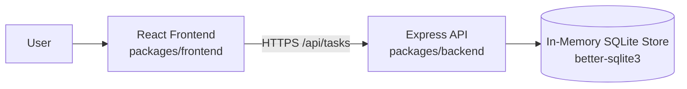
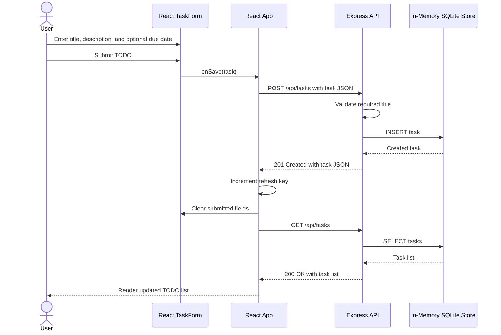

# Cloud Architecture Overview

## System Context

The application is a monorepo with a React frontend and an Express API. The API
stores task data in an in-memory SQLite database, so data is not retained when
the backend process restarts.

## Create a TODO Sequence

